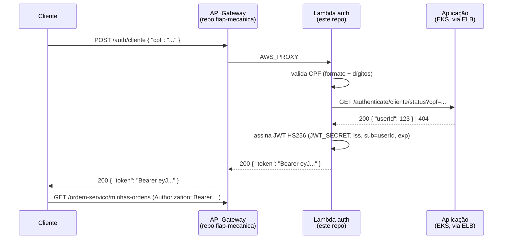

# fiap-mecanica-lambda

## Propósito

**Function AWS Lambda de autenticação de cliente por CPF** — Fase 3 do projeto [Mecânica FIAP](https://github.com/ArthurPeruzzo/fiap-mecanica).

O cliente não tem usuário/senha: envia só o CPF, a Lambda confirma a identidade contra a aplicação e devolve um **JWT** que os endpoints de cliente da aplicação aceitam. É exposta como a rota `POST /auth/cliente` do API Gateway (a rota vive no repositório da aplicação; esta função é referenciada por nome).

Um dos **4 repositórios** da Fase 3 (Aplicação, Infra Kubernetes, Infra de Banco, Lambda — este). É independente dos demais: tem state Terraform próprio e não lê nem é lido via `terraform_remote_state`.

## Tecnologias

- **Node.js 22** + **TypeScript** (sem dependências de runtime além de `jsonwebtoken`; `fetch` nativo)
- **esbuild** — bundle único minificado (`npm run package` → `build/function.zip`, ~20 KB)
- **vitest** — testes de unidade (fetch e env mockados)
- **Terraform** — `aws_lambda_function` + log group (backend S3 com `use_lockfile`, `required_version >= 1.10`)
- **AWS**: Lambda (`nodejs22.x`, 256 MB, timeout 25s, sem `vpc_config`), CloudWatch Logs, IAM `LabRole` (execução)
- **GitHub Actions** (CI/CD)

## Arquitetura



O JWT é **intencionalmente compatível** com o `UserAuthenticationFilter` da aplicação: `HS256` sobre o mesmo `JWT_SECRET`, `iss = mecanica-fiap`, `sub = <userId>`, `exp = agora + TOKEN_TTL_HOURS`.

**Sem `vpc_config`** de propósito: a função precisa alcançar o ELB público da aplicação, e a VPC do projeto só tem subnets públicas sem NAT gateway — dentro da VPC a Lambda ficaria sem rota para a internet.

## Contrato HTTP (integração proxy do API Gateway)

`POST /auth/cliente` com corpo `{ "cpf": "<cpf>" }` (com ou sem pontuação):

| Status | Corpo | Quando |
|---|---|---|
| `200` | `{ "token": "Bearer <jwt>" }` | cliente identificado |
| `400` | `{ "error": "CPF invalido" }` | CPF ausente / mal formado / dígitos inválidos |
| `404` | `{ "error": "Cliente nao encontrado" }` | nenhum cliente para o CPF |
| `502` | `{ "error": "Servico de autenticacao indisponivel" }` | aplicação respondeu erro / resposta inesperada |
| `504` | `{ "error": "Tempo limite ao contatar o servico de autenticacao" }` | timeout da chamada à aplicação |
| `500` | `{ "error": "Erro interno de configuracao" }` | variável de ambiente obrigatória ausente/inválida |

**Cadeia de timeouts em produção:** `HTTP_TIMEOUT_MS 15s < timeout da Lambda 25s < timeout do API Gateway 30s` — o HTTP tem que estourar antes da Lambda para que ela consiga responder `504` em vez de ser morta pelo runtime.

## Variáveis de ambiente

Veja `.env.example`. Em produção são definidas pelo Terraform (`aws_lambda_function.environment`).

| Var | Obrigatória | Default (Terraform) | Uso |
|---|---|---|---|
| `APP_BASE_URL` | sim | placeholder | Base da aplicação, sem barra final. Aponta direto para o **ELB** (um hop a menos que passar pelo gateway). O hostname muda a cada recriação do Service — o job `apigw-apply` do CD da **aplicação** repassa o valor real via `aws lambda update-function-configuration`. |
| `JWT_SECRET` | sim | — (secret) | **Mesmo** segredo Base64URL da aplicação (≥ 32 bytes decodificados). Se divergir, o token é emitido mas rejeitado pelo filtro da app. |
| `JWT_ISSUER` | não | `mecanica-fiap` | Claim `iss`; precisa bater com `jwt.issuer` da app |
| `TOKEN_TTL_HOURS` | não | `4` | Validade do token |
| `HTTP_TIMEOUT_MS` | não | `15000` | Timeout da chamada à aplicação. O default do `config.ts` é `3000`, apertado demais na prática (cold start da JVM); o Terraform sobe para 15000. |

## Desenvolvimento

```bash
npm ci
npm test            # vitest run
npm run typecheck   # tsc --noEmit
npm run package     # esbuild bundle + zip → build/function.zip
npm run invoke:local -- <cpf>   # compila e invoca o handler de verdade contra a app local (usa .env)
```

`invoke:local` precisa da aplicação Java de pé em `http://localhost:8080` e de um CPF com cliente no banco (o seed da app tem `65997627004`).

### Estrutura

```
src/
  handler.ts                  entrypoint (API Gateway proxy)
  config.ts                   leitura/validação de env (cold start)
  errors.ts                   AppError tipado → status HTTP
  validation/cpf.ts           normalização + dígitos verificadores
  auth/
    authenticateCustomer.ts   orquestra: valida CPF → consulta app → assina JWT
    clienteStatusClient.ts    GET /authenticate/cliente/status (fetch nativo)
    jwt.ts                    signCustomerToken() — HS256, contrato do filtro da app
test/                         vitest (unidade; fetch e env mockados)
infra/terraform/aws/          aws_lambda_function + log group (state tfstate/lambda.tfstate)
scripts/invoke-local.mjs      invocação local do handler
```

## Execução e deploy

### Automático (CI/CD)

- **`ci.yml`** (Pull Request): `npm ci` → `typecheck` → `test` → `npm run package` → confere que o bundle carrega e exporta o `handler`. Depois `terraform plan` (preservando o `APP_BASE_URL` já configurado).
- **`cd.yml`** (push na `main`): garante o bucket do backend → `npm ci && npm run package` → `terraform init` → lê o `APP_BASE_URL` atual da função (para não sobrescrever com o placeholder) → `terraform apply`.

Branch `main` protegida — merge só via Pull Request.

**Secrets:** `AWS_ACCESS_KEY_ID`, `AWS_SECRET_ACCESS_KEY`, `AWS_SESSION_TOKEN` (sessão da Academy Lab) e `JWT_SECRET` — **idêntico** ao do repositório `fiap-mecanica`.

### Manual

```bash
npm ci && npm run package
cd infra/terraform/aws
terraform init
TF_VAR_jwt_secret=<segredo> TF_VAR_app_base_url=http://<elb-host> terraform apply
```

### Ordem numa infra do zero

Independente dos outros — mas a rota `POST /auth/cliente` só é criada pelo CD da **aplicação** (`apigw-apply`) se esta função **já existir**. Por isso o deploy recomendado é `infra-k8s` → `infra-db` → **`lambda`** → `fiap-mecanica`: com a Lambda no ar antes do último passo, a rota sai na primeira passada. Se o CD do `fiap-mecanica` rodar antes desta função existir, ele avisa e basta re-executá-lo depois.

## Documentação da API

O contrato de `POST /auth/cliente` está na seção [Contrato HTTP](#contrato-http-integração-proxy-do-api-gateway) acima. Os endpoints **protegidos** que o token retornado destrava (Swagger UI) estão no repositório da aplicação: [fiap-mecanica](https://github.com/ArthurPeruzzo/fiap-mecanica#documentação-da-api).
