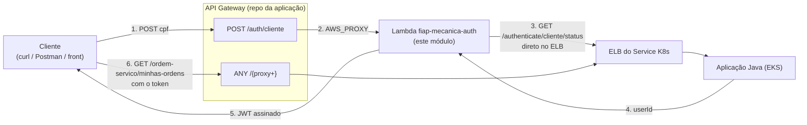

# Infraestrutura AWS — fiap-mecanica-lambda (Terraform)

Provisiona a **Function Lambda de autenticação de cliente por CPF** (Fase 3) e o log group dela.

> **Este módulo cria só a função.** A rota que a expõe (`POST /auth/cliente`) vive no API Gateway,
> que fica no repositório da aplicação (`fiap-mecanica/infra/terraform/apigateway`) e referencia
> esta função **por nome**, através da variável `auth_lambda_name`. Cada repositório publica o que
> é seu: aqui a função, lá a rota.

## Fluxo



A perna 3 **não passa pelo gateway** — a Lambda fala direto com o ELB. Só a entrada (perna 2) passa.

## Recursos criados

| Arquivo | Recurso | O que é |
|---|---|---|
| `main.tf` | `data.aws_iam_role.lab_role` | Execution role. A conta AWS Academy Lab não permite criar IAM roles próprias — mesmo padrão do EKS no repo da aplicação |
| `main.tf` | `aws_cloudwatch_log_group.auth` | `/aws/lambda/fiap-mecanica-auth`, com retenção. Criado explicitamente porque um log group criado sob demanda pela Lambda **nunca expira** |
| `main.tf` | `aws_lambda_function.auth` | `nodejs22.x`, handler `handler.handler`, timeout 25s, 256 MB, **sem `vpc_config`** |
| `backend.tf` | — | Backend `s3` (bucket `fiap-mecanica`, `tfstate/lambda.tfstate`). O bucket é criado pelo repo da aplicação — sem bootstrap próprio |

### Por que a função fica fora da VPC
Ela precisa alcançar o **ELB público** da aplicação. A VPC do projeto só tem subnets públicas e
não tem NAT gateway; dentro dela, a Lambda ficaria sem rota para a internet e a chamada HTTP
falharia. Se um dia o ELB virar interno, aí sim será preciso `vpc_config` + NAT.

## Cadeia de timeouts

```
HTTP_TIMEOUT_MS (15s)  <  timeout da Lambda (25s)  <  timeout do API Gateway (30s)
```

A ordem importa: o timeout HTTP precisa estourar **antes** do da Lambda, senão o runtime mata a
função e o cliente recebe um erro genérico em vez do `504` com mensagem tratada. Os 30s do HTTP
API são teto rígido da AWS, não configuráveis.

## Variáveis (`vars.tf`)

| Variável | Default | Descrição |
|---|---|---|
| `function_name` | `fiap-mecanica-auth` | Nome da função — é o valor esperado em `auth_lambda_name`, no módulo do gateway |
| `region_default` | `us-east-1` | Região AWS |
| `package_path` | `../../../build/function.zip` | Zip gerado por `npm run package` |
| `app_base_url` | placeholder | Ver "Como o endereço da aplicação é mantido" abaixo |
| `jwt_secret` | — (obrigatório, sensível) | **Precisa ser idêntico ao `JWT_SECRET` da aplicação** |
| `jwt_issuer` | `mecanica-fiap` | Claim `iss`; precisa bater com `jwt.issuer` da aplicação |
| `token_ttl_hours` | `4` | Validade do token, espelhando a aplicação |
| `http_timeout_ms` | `15000` | Timeout da chamada à aplicação |
| `lambda_timeout_seconds` | `25` | Timeout da função |
| `log_retention_days` | `7` | Retenção no CloudWatch |

## Como o endereço da aplicação é mantido

`APP_BASE_URL` é o hostname do ELB do Service Kubernetes — gerado pela AWS e **trocado a cada
recriação do Service**. Este repositório não tem como conhecê-lo.

Quem o mantém em dia é o job `apigw-apply` do CD da **aplicação**, que roda depois do deploy no
cluster, já sabe o hostname e executa um `aws lambda update-function-configuration`.

Para que o próximo `apply` daqui não sobrescreva aquele valor pelo placeholder, o CD deste
repositório **lê o valor corrente da função** e o repassa em `TF_VAR_app_base_url`:

```bash
ATUAL=$(aws lambda get-function-configuration --function-name fiap-mecanica-auth \
        --query 'Environment.Variables.APP_BASE_URL' --output text 2>/dev/null || true)
```

Optou-se por isso em vez de `lifecycle { ignore_changes = [environment] }`, que resolveria o
mesmo problema mas impediria o Terraform de atualizar o `JWT_SECRET` numa rotação de segredo.

## Como aplicar manualmente

```bash
npm run package                       # gera build/function.zip na raiz do repo
cd infra/terraform/aws
terraform init
terraform apply -var jwt_secret=<mesmo-segredo-da-aplicacao>
```

Para testar a função isolada, sem o gateway — separa problema de função de problema de rota:

```bash
aws lambda invoke --function-name fiap-mecanica-auth \
  --payload '{"body":"{\"cpf\":\"65997627004\"}"}' \
  --cli-binary-format raw-in-base64-out /dev/stdout
```

## Ordem de deploy numa infra do zero

1. CD da **aplicação** — cria VPC/EKS/RDS/ECR, sobe a app, cria o gateway (ainda sem a rota da Lambda).
2. CD **deste repositório** — cria a função, com `APP_BASE_URL` placeholder.
3. CD da **aplicação** de novo — cria a rota `POST /auth/cliente` **e** grava o hostname real do
   ELB na função.

Da segunda vez em diante, cada repositório faz deploy sozinho.

## Operação no dia a dia

**Mudou o código da função? Só o CD deste repositório. Não precisa rodar o CD da aplicação.**

O gateway referencia esta função pelo **ARN**, que é derivado do nome
(`arn:aws:lambda:us-east-1:<conta>:function:fiap-mecanica-auth`) e não por um id gerado — publicar
código novo não muda o ARN. Além disso, o `data "aws_lambda_function"` do outro repositório não usa
`qualifier`, então resolve para `$LATEST`: o gateway passa a entregar a versão nova sozinho.

O `APP_BASE_URL` também sobrevive, porque o CD daqui lê o valor corrente da função antes do apply
(ver "Como o endereço da aplicação é mantido").

### As quatro exceções

| Situação | Por que exige o CD da aplicação |
|---|---|
| Primeira vez | A rota `POST /auth/cliente` só é criada depois que a função existe |
| A função foi **destruída e recriada** | A `aws_lambda_permission` vive no *resource policy* da função. Recriando, ela some — e o gateway passa a devolver **500** |
| A função foi **renomeada** | `auth_lambda_name`, no outro repositório, continua apontando para o nome antigo |
| O ELB mudou | Mas isso já é o CD da aplicação rodando, e é ele quem atualiza o `APP_BASE_URL` aqui |

> **Sintoma reconhecível:** `500` em `POST /auth/cliente` logo depois de mexer na função (destruir,
> recriar, renomear). É a permissão que se perdeu. Rodar o CD da aplicação uma vez recria.

Por que essa permissão não pode morar aqui: ela precisa do `execution_arn` do gateway (state da
aplicação) **e** do nome desta função (state daqui). Trazê-la para este módulo criaria dependência
circular entre os dois states. Fica do lado do gateway, e o preço é essa exceção rara.

**O inverso nunca acontece:** o CD da aplicação não depende deste. Ele checa
`aws lambda get-function` e, se a função não existir, apenas emite um aviso e segue — nenhum
deploy da aplicação fica bloqueado por causa da Lambda.

## Secrets no GitHub

`AWS_ACCESS_KEY_ID`, `AWS_SECRET_ACCESS_KEY`, `AWS_SESSION_TOKEN` (renovar a cada sessão do
Academy Lab) e `JWT_SECRET`.

> ⚠️ O `JWT_SECRET` tem que ser **exatamente o mesmo** do repositório da aplicação. Se divergir, a
> Lambda emite o token normalmente e o erro só aparece depois, como `401` ao usar esse token — um
> sintoma que não aponta para a causa. É a primeira coisa a conferir se o fluxo falhar no fim.

## Limitação conhecida

O `JWT_SECRET` fica como variável de ambiente da função, ou seja, **em texto plano** na
configuração dela — visível a quem tiver `lambda:GetFunctionConfiguration`. O certo seria SSM
Parameter Store (SecureString). Aceito no escopo deste projeto acadêmico.
